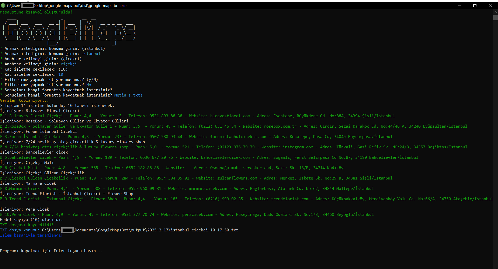

# Google Maps İşletme Bilgileri Botu

Bu bot, Google Maps üzerinden işletme bilgilerini otomatik olarak toplayan bir Node.js uygulamasıdır.



## 🚀 Özellikler

- 🔍 Konum ve anahtar kelimeye göre işletme arama
- 📊 İstediğiniz sayıda işletme bilgisi toplama
- ⭐ Minimum puan filtreleme
- 💾 Excel (.xlsx) veya Metin (.txt) formatında kaydetme
- 📝 Detaylı işletme bilgileri:
  - İşletme adı ve türü
  - Adres ve telefon
  - Website
  - Puan ve yorum sayısı
  - Çalışma saatleri
  - Fotoğraflar
  - Özellikler (Otopark, ödeme yöntemleri vb.)

## 📥 İndirme ve Kurulum

### Windows Kullanıcıları İçin Kolay Kurulum

1. [En Son Sürümü İndirin](dist/google-maps-bot.exe)
   - Sayfadaki `google-maps-bot.exe` dosyasını indirin
   

2. Programı Çalıştırın
   - `google-maps-bot.exe` dosyasına çift tıklayın
   - İlk çalıştırmada Windows Defender uyarı verebilir
   - "Daha fazla bilgi" → "Yine de çalıştır" seçeneklerini kullanın

### Geliştiriciler İçin Kurulum

1. [Node.js'i indirin ve kurun](https://nodejs.org/) (En son sürüm)
2. [Google Chrome'u indirin ve kurun](https://www.google.com/chrome/) (Eğer yüklü değilse)
3. Bu projeyi bilgisayarınıza indirin:
   ```bash
   git clone https://github.com/grkm/google-maps-scraper.git
   cd google-maps-scraper
   npm install
   ```

## 💻 Kullanım

### Windows Kullanıcıları İçin
1. `google-maps-bot.exe` dosyasına çift tıklayın
2. İstenilen bilgileri girin:
   - Aranacak konum (örn: istanbul)
   - Anahtar kelime (örn: çiçekçi)
   - Kaç işletme bilgisi toplanacak
   - Minimum puan filtresi
   - Kayıt formatı (Excel/TXT)

### Geliştiriciler İçin
```bash
# Normal çalıştırma
npm start

# Geliştirici modu
npm run dev

# Executable oluşturma
npm run build
```

## 📂 Çıktılar

Toplanan veriler otomatik olarak Belgeler (Documents) klasörünüzde saklanır:

```
Documents/
└── GoogleMapsBot/
    └── output/
        └── GG_AA_YYYY/
            ├── konum-keyword-sayi-saat.xlsx
            └── konum-keyword-sayi-saat.txt
```

### Kolay Erişim
- Masaüstünde "GoogleMapsBot Çıktıları" kısayolu oluşturulur
- Bu kısayol ile tüm çıktılara hızlıca erişebilirsiniz

## ⚠️ Önemli Notlar

1. İnternet bağlantınızın stabil olduğundan emin olun
2. Google Chrome'un güncel olduğundan emin olun
3. Bot çalışırken Chrome penceresini kapatmayın
4. Çok fazla istek atılması durumunda Google geçici olarak engelleme yapabilir

## 🆘 Sık Karşılaşılan Sorunlar

1. "Chrome kurulu değil" hatası:
   - Google Chrome'u yükleyin ve yeniden deneyin

2. Windows Defender Uyarısı:
   - "Daha fazla bilgi" seçeneğine tıklayın
   - "Yine de çalıştır" butonuna tıklayın

3. Program Yanıt Vermiyor:
   - Programı kapatıp yeniden başlatın
   - Chrome'u güncelleyin
   - Bilgisayarı yeniden başlatın

## 📞 Destek ve İletişim

- GitHub üzerinden issue açabilirsiniz
- Pull request gönderebilirsiniz
- [İletişim için tıklayın](mailto:info@example.com)

## 📜 Lisans

Bu proje MIT lisansı altında lisanslanmıştır. Detaylar için `LICENSE` dosyasına bakın. 